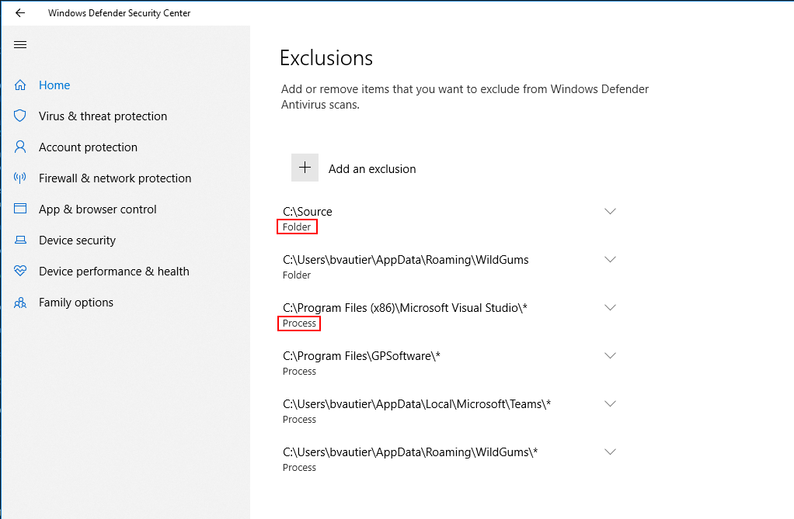

# Boxstarter scripts

This repository contains boxstarter scripts to help setup a dev environment on a new windows box.

There is a two step process, some large installs like VS, SQL server etc.. are done manually.

You can run the scripts multiple times. If a program is already installed it will just be skipped.

## Introduction

- The boxstarter list only contains software I use regularly.
- The boxstarter links to use in IE are found at the top of each file.
- The order in which the files should be run are:
    1. Update BIOS (for new installs)
    1. **UpdateWindows.txt** (Run this just after installing windows.)
    1. Install drivers (for new installs)
    1. **InstallSoftware.txt**
    1. Manual Installs
       - [VisualStudio](https://visualstudio.microsoft.com/downloads/)
       - Office (Through office365)
       - [Git Credentials manager](https://github.com/Microsoft/Git-Credential-Manager-for-Windows/)
       - [OneDrive](https://onedrive.live.com/about/en-au/download/)
       - [Fences](https://www.stardock.com/products/fences/)
       - [Fork](https://git-fork.com/) (git client)
       - [Directory Opus](https://www.gpsoft.com.au/)
       - [bvckup2](https://bvckup2.com/)
       - [Kindle](https://www.amazon.com/kindle-dbs/fd/kcp)
       - [Draw.io](https://about.draw.io)
    1. **PostInstall.txt**
    1. **UpdateWindows.txt** (Run windows update again.)
    1. (Optional) Run CCleaner and KCleaner to get rid of all the junk. (These are installed in the scripts above)
    1. Run [Simple System Tweaker](http://www.tweaking.com/content/page/simple_system_tweaker.html)

**NOTE:** Whenever you need a program check [Chocolatey](http://chocolatey.org/) first. It is the best place to discover the most used programs by developers for any category.

Most of the programs are available for free.

## Post Install - Configurations

- Make Notepad2-mod the default text editor: http://www.flos-freeware.ch/doc/notepad2-Replacement.html
  (This will happen automatically after running the Boxstarter scripts)
- Files and Folder:

  - [Folder Organisation](http://www.howtogeek.com/howto/15677/zen-and-the-art-of-file-and-folder-organization/)
  - [Application Launcher](http://www.howtogeek.com/howto/11166/use-quick-launch-as-a-super-powered-application-launcher/)

### Chrome

Install Chrome Extensions and Chrome Apps: Check the "Chrome Extensions"  and "Chrome Apps" sections [here](http://orcomp.github.io/Blog/#docs/list_of_useful_software).

- Type "Chrome://flags" into the URL box
  - Set "Enable" resume downloads

### Antivirus

The default anti virus that comes with Windows is good enough if you surf the web sensibly.

In WindowsDefender add the following exclusions:

- Folder: C:\Source folder to the exclusion
- Process: VisualStudio installation folder

Read: https://docs.microsoft.com/en-us/windows/security/threat-protection/windows-defender-antivirus/configure-extension-file-exclusions-windows-defender-antivirus

### Partitions

Since the OS will be going on a SSD drive no need to partition.

## Paid software

I generally try and use free or open source software as much as possible. So when I pay for something it is generally really worth it.

- [Directory Opus](https://www.gpsoft.com.au/)
- [bvckup2](https://bvckup2.com/)
- [Fences](https://www.stardock.com/products/fences/)

## Notes

- (**Obsolete:** [My Official Software List](http://orcomp.github.io/Blog/#docs/list_of_useful_software) This document as well as the boxstarter scripts are more up to date.)
- Markdown: Use VSCode with some markdown extensions
- VSCode extensions: https://stackoverflow.com/questions/35773299/how-can-you-export-vs-code-extension-list
- Visual Studio extensions: https://stackoverflow.com/questions/22154485/getting-a-list-of-installed-extensions-and-packages-in-visual-studio-2013
- Chrome Extensions: type in "chrome://system" then click on the expand extensions button
- DirectoryOpus settings

## Keep an eye on

- https://www.duplicati.com/
- https://keeweb.info/
- [ILSpy](https://github.com/icsharpcode/ILSpy)
- [Directory Monitor](https://www.deventerprise.com/)
- [UltraSearch](https://www.jam-software.com/ultrasearch/)
- [FreeFileSync](https://freefilesync.org/)
- [AllDup](http://www.alldup.de/alldup_help/alldup.php)
- [SqliteBrowser](http://sqlitebrowser.org/)

## Guides

### Re-install XPS 15 9570

A lot easier than I initially thought.

- Download the Windows media creation tool (https://www.microsoft.com/en-au/software-download/windows10), which will help setup a Windows 10 installation image on a USB stick.
- Plug the USB stick into the laptop. (Do not make any changes to the BIOS or settings)
- Start up the laptop and hold the F12 button down to access the BIOS settings.
- Select the USB stick option and continue. (Yes it is that simple...)
- Go though the installation process. At some stage you will need to repartition the hard drive. Delete all the partitions so that only one line is left and then click "Next". (i.e. do not click on "New").
- Once Windows 10 is installed you will have to install the drivers.
- You only need to download and install the "Dell Command | Update" package to install all the drivers, from the Dell support page. After installing it, reboot the computer and run it.

#### Fan issue

- Only use CPU graphics (disable NVIDIA GPU using the "NVIDIA Control panel" application)

**Other solutions:**

- Install "Dell Power Manager" from the windows store: Set to quiet

- https://www.dell.com/community/XPS/XPS-9370-Fan-Noise/td-p/5803616/page/17
- https://communities.intel.com/thread/115794
- https://www.reddit.com/r/Dell/comments/5y3rii/xps_9560_battery_life_optimization_and_fan/

#### DPI issues on external monitor

Visual Studio and other apps not rendering properly.

Short answer: Make the external monitor the primary monitor.

- https://developercommunity.visualstudio.com/content/problem/25097/font-is-blurry-due-to-not-supporting-mixed-mode-dp.html
- https://www.danantonielli.com/adobe-app-scaling-on-high-dpi-displays-fix/

#### BIOS changes
